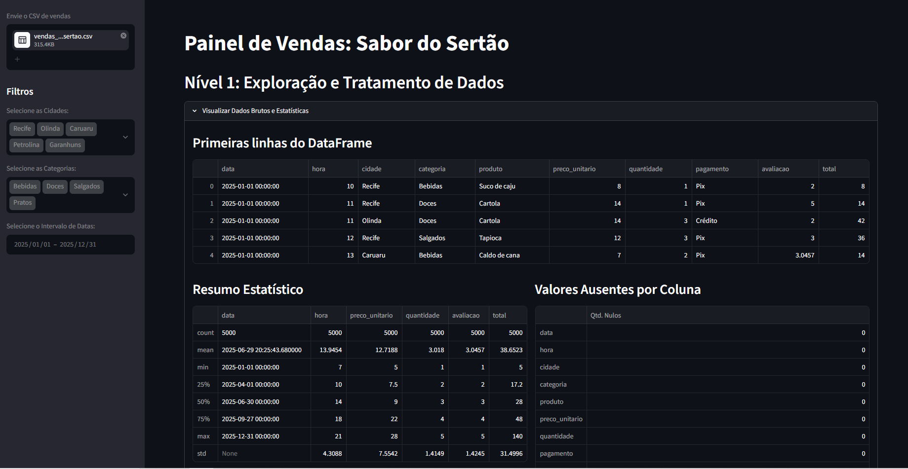

# 🌵 Painel de Vendas: Sabor do Sertão

Dashboard interativo desenvolvido com **Streamlit**, **Pandas** e **Plotly** para análise exploratória e acompanhamento dos indicadores de vendas da rede Sabor do Sertão.



## 🚀 Funcionalidades

- **Nível 1: Exploração e Tratamento de Dados**: Visualização dos dados brutos, estatísticas descritivas, contagem e tratamento de valores ausentes.
- **Nível 2: Indicadores Principais (KPIs)**: Faturamento Total, Número de Vendas, Ticket Médio e Avaliação Média dos clientes.
- **Nível 4: Visualizações Interativas**:
  - Faturamento Mensal (Linhas)
  - Faturamento por Cidade (Barra)
  - Top Produtos Mais Vendidos
  - Distribuição por Forma de Pagamento
  - Mapa de Calor (Hora x Dia da Semana)
- **Nível 5: Insights do Gestor e Exportação**: Recomendações estratégicas e download dos dados filtrados em formato `.csv`.

## 🛠️ Como Executar o Projeto

1. Clone o repositório:
   ```bash
   git clone [https://github.com/SEU_USUARIO/Task-Cloud.git](https://github.com/SEU_USUARIO/Task-Cloud.git)
   cd Task-Cloud

    Instale as dependências:

    py -m pip install -r requirements.txt

    Execute a aplicação Streamlit:

    py -m streamlit run app.py
---

### 4. Passos para Subir para o GitHub

1. **Guarda a captura do ecrã**:
   Tira print da tela do browser com o painel a funcionar e guarda o ficheiro dentro da pasta `Task-Cloud` com o nome **`dashboard.png`**.

2. **Inicia o Git e faz o Commit**:
   Abre o terminal dentro da pasta `Task-Cloud` no VS Code/PowerShell e executa os comandos:

   ```powershell
   git init
   git add .
   git commit -m "feat: entrega do painel de vendas Streamlit"
